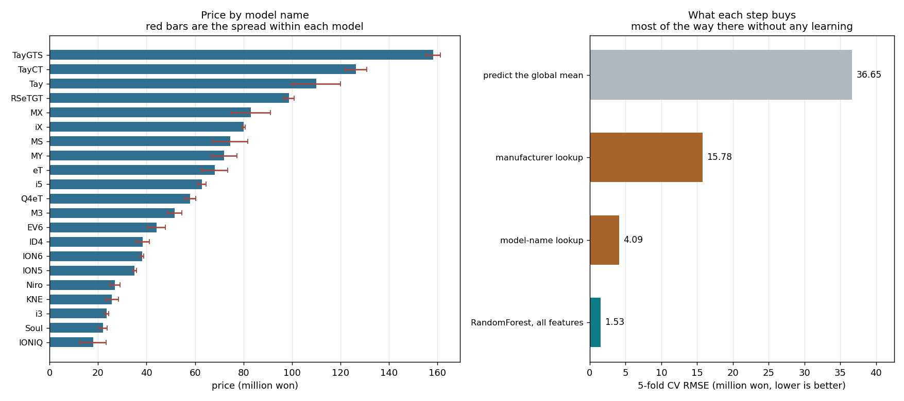

# EV Price Prediction


Predicting used electric-vehicle prices from specification data — 7,497 cars,
nine features, prices from 9 to 161 million won. Built for a DACON competition.

The model reaches **RMSE 1.53 ± 0.12 million won** under 5-fold cross-validation
(R² = 0.998). That number on its own is misleading, so this README reports the
ladder it sits on top of.



## The ladder

| Predictor | CV RMSE (million won) | R² |
|---|---|---|
| Predict the global mean | 36.65 | — |
| Manufacturer lookup table | 15.78 | 0.815 |
| **Model-name lookup table** | **4.09** | **0.988** |
| RandomForest, model name only | 4.09 ± 0.10 | 0.988 |
| RandomForest, everything *except* model name | 10.85 ± 0.39 | 0.912 |
| **RandomForest, all features** | **1.53 ± 0.12** | **0.998** |

Reading down the table: 98.8% of the variance in this dataset is explained by a
21-row lookup table of mean price per model name. No learning, no features, no
model — just `groupby('모델').mean()`, scored out-of-fold so the number is
honest.

Two rows are worth pausing on.

**The lookup table and the RandomForest trained on model name alone give the
identical 4.09.** That is not a coincidence. Given one categorical feature, a
regression tree's best available prediction for each category *is* its mean, so
the forest reconstructs the lookup table and stops.

**Dropping model name costs more than every other feature combined is worth.**
Without it the RMSE is 10.85; with it alone, 4.09.

So the honest claim for this project is not "predicts price from specifications"
but: *the model name fixes the price band, and the specification variables
resolve position within that band, taking RMSE from 4.09 to 1.53.*

## What the specifications actually explain

Subtracting each car's model mean leaves a residual with a spread of 4.08
million won. The remaining eight features predict that residual to **RMSE 2.28
(R² = 0.686)** — so they carry real signal, just at a scale an order of
magnitude below the model name.

Permutation importance, measured as the increase in RMSE when a feature is
shuffled:

| Feature | Δ RMSE |
|---|---|
| 모델 (model) | 36.73 ± 0.29 |
| 제조사 (manufacturer) | 31.21 ± 0.22 |
| 배터리용량 (battery capacity) | 8.50 ± 0.12 |
| 보증기간 (warranty years) | 3.13 ± 0.04 |
| 주행거리 (mileage) | 2.99 ± 0.05 |
| 차량상태 (condition) | 1.08 ± 0.03 |
| 구동방식 (drivetrain) | 0.67 ± 0.01 |
| 연식 (model year) | 0.34 ± 0.02 |
| 사고이력 (accident history) | 0.03 ± 0.00 |

Battery capacity is the strongest specification variable despite being **missing
for 36% of rows** (2,711 of 7,497, median-imputed). Its Pearson correlation with
price is only 0.044, which is why a correlation matrix suggested it was
irrelevant and the tree model disagreed: the relationship is real but not
monotonic, and correlation only measures the monotonic part.

## A caveat about the data

Accident history and model year come out at 0.03 and 0.34. In real used-car
pricing those two dominate — age drives depreciation, and a recorded accident
cuts resale value sharply. Their absence here is a property of a synthetic
competition dataset, not a finding about used EVs.

This matters for what the project can claim. It demonstrates a modelling
workflow and a way of reporting results. It does not tell you anything about the
actual used EV market, and the write-up should not pretend otherwise.

## Pipeline

- **Imputation** — KNN (k=5) for mileage, warranty and model year; most-frequent
  for categoricals; median for battery capacity.
- **Encoding** — label encoding for the five categorical columns. Fine for tree
  models, which split on values rather than reading them as ordered; it would be
  wrong for a linear model.
- **Model** — `RandomForestRegressor`, 5-fold `KFold` cross-validation.

## Repository

```text
├── main.ipynb              # EDA and the original modelling notebook
├── baseline_vs_model.py    # the ladder, residual analysis and importances above
├── train.csv / test.csv    # competition data
└── submission.csv          # generated predictions
```

```bash
pip install pandas numpy scikit-learn matplotlib
python baseline_vs_model.py
```

Every figure in this README is produced by that script; nothing is quoted from
memory.

## Note on an earlier version

The first write-up described this as predicting price "based on battery capacity
and vehicle specification data", and reported a single validation RMSE of 1.62
with no baseline beside it. Both statements were defensible in isolation and
misleading together: without the 4.09 lookup-table baseline, 1.62 reads as the
achievement of the model rather than of the dataset's structure. The analysis
above was added to establish what the number is actually measuring.
